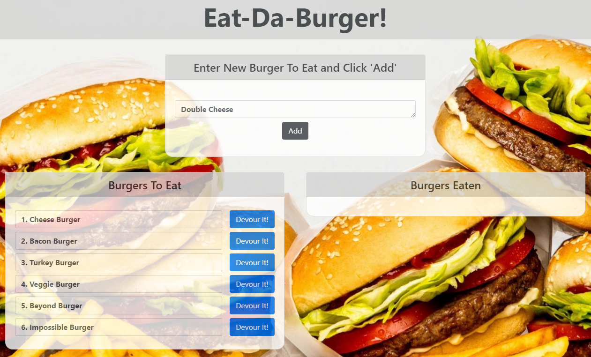

# 13-Node Express Handlebars-Eat-Da-Burger!
___
## Objective
Create an application that generates a burger logger app with MySQL, Node, Express, Handlebars and a homemade ORM. It follows the MVC design pattern; using Node and MySQL to query and route data in the app, and Handlebars to generate the HTML.
___
## Table of Contents
* [Description](#description)
* [Installation](#installation)
* [Usage](#usage)
* [License](#license)
* [Contributing](#contributing)
* [Questions](#questions)
* [Application_Links_and_Images](#application_links_and_images)
## Description:
 Eat-Da-Burger! is a restaurant app that lets users input the names of burgers they would like to eat.  Whenever a user submits a burger's name, the app will display the burger on the left side of the page, waiting to be devoured. Each burger in the waiting area also has a `Devour it!` button. When the user clicks it, the burger will move to the right side of the page. The app stores every burger in a database (burgers_db), whether devoured or not.
___
## Installation
(1) Type **npm i** (install) to install all required dependencies for the app   
(2) Invoke the app by going to the server.js file, open in integrated terminal, and type: **node server.js**    
(3) The Server is now listening on: **http://localhost:8080**   
(4) Open a webpage and type into the url: **http://localhost:8080**   
(5) The app is now running and the user can 'Add' Burger names to add them to the 'Burgers To Eat' column, or click on the 'Devour It!' button to move a burger to the 'Burgers Eaten' column.
   
_____
## Usage
This App allows the user to 'Add' a burger to the 'Burger to Eat' column, and then eat burgers by clicking the 'Devour It! button, which moves it to the 'Burgers Eaten' column. 
_____
## Contributing
ed-sivick, Stack Overflow, Grepper, BCS support for functionality, code syntax, and Heroku deployment instruction
_____
## Questions
If there are any questions, or if you would prefer more information concerning this app,
please contact the following person at their GitHub profile or email address below:

* [GitHub Profile](https://github.com/ed-sivick)
* ed@sivick.net
_____
## License
You can view more information concerning software licenses at the following link:

* [License](https://opensource.org/licenses/MIT)
_____
## Badges

___
## Application_Links_and_Images  
**Links:**  
Heroku link: (https://arcane-inlet-67971.herokuapp.com/)   

**Application Image Examples:** 

<strong>Image of burger in the 'Enter New Burger' text field</strong>

  
  
 

<strong>Image of burger added to the 'Burgers To Eat' column</strong>

  

  
  

  
 
  

<strong>Image of burger devoured and added to the 'Burgers Eaten' column</strong>

  

  
  
 

<strong>Image of all burgers devoured and added to the 'Burgers Eaten' column</strong>

  

  
  
 